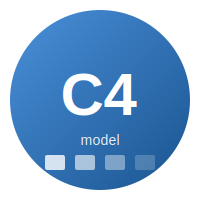
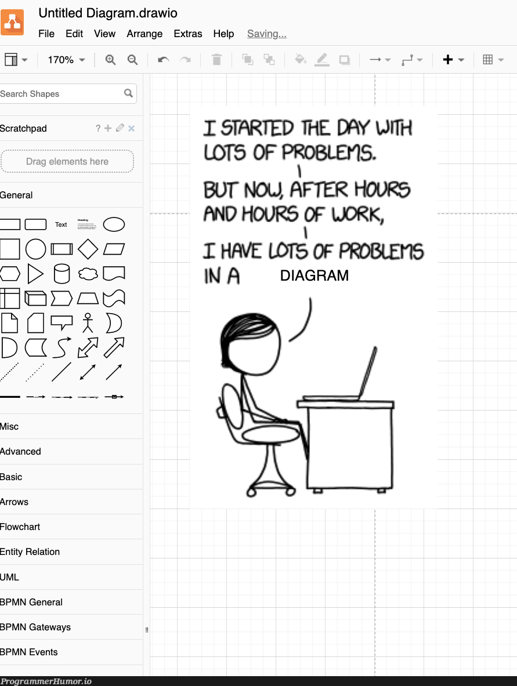
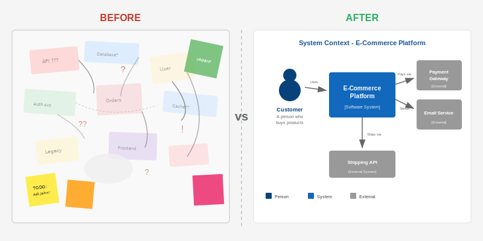
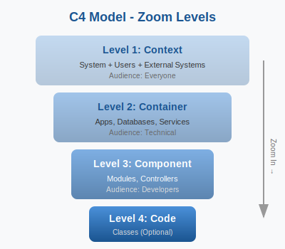
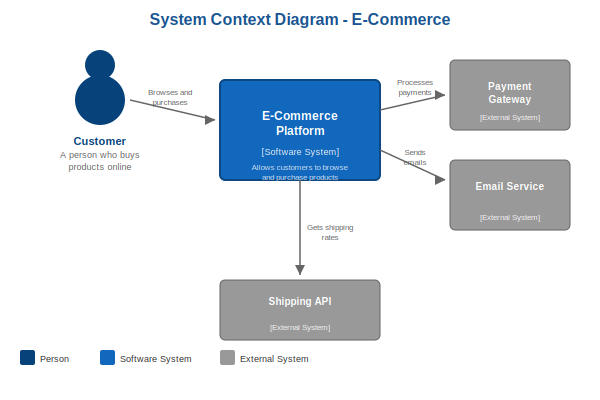
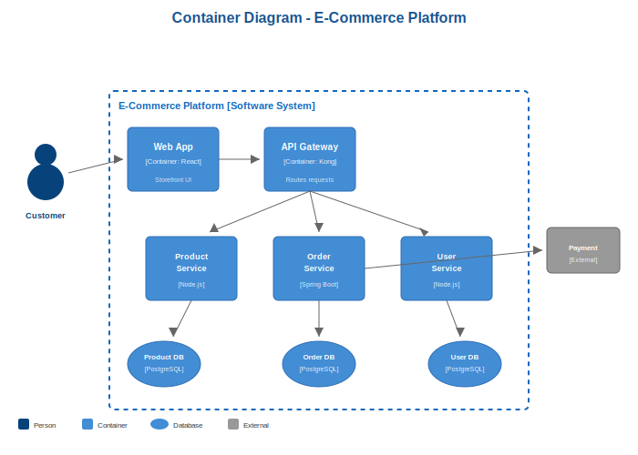
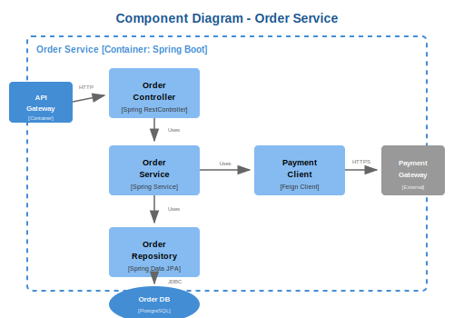
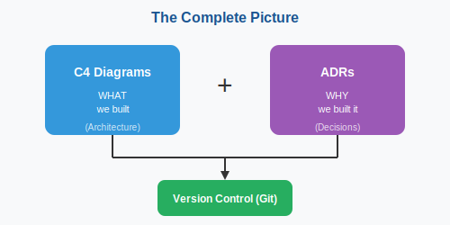

# Diagram as Code and ADRs
## Documenting the 'What' and 'Why'

**Ioannis Skitsas**
Patras Tech Talk 2026.01 | January 20, 2026


---

<!-- _class:  invert -->
<style scoped>
section { padding-left: 240px; }
</style>

|  |  |
|  |  |

---

<!-- _class: invert -->



---

<!-- _class: invert -->



---

# Why Diagrams Matter

<div class="columns">
<div>

## Communication
- **Developers** need technical details
- **Ops** needs deployment architecture
- **Management** needs the big picture
- **New hires** need onboarding

</div>
<div>

## The Problem
- Outdated the moment they're drawn
- Lost in Confluence/SharePoint
- Multiple versions, no source of truth
- Created in tools outside dev workflow

</div>
</div>

> *"A map gets outdated as roads change — what if your map updated itself?"*

---

# The Architecture Amnesia Problem

> *"Has anyone joined a project and spent days trying to figure out how things connect?"*

- Scattered wiki pages
- Outdated Visio diagrams
- "Ask John, he knows"
- [Tribal knowledge](https://www.proserveit.com/blog/five-monkeys-experiment-lessons)

---

# The Solution

- Version-controlled diagrams
- Always up-to-date
- Self-documenting
- Searchable decisions

---

# Diagram Tools Landscape

| Category | Tools | Pros | Cons |
|----------|-------|------|------|
| **Manual** | Visio, Draw.io, Lucidchart, Miro | Easy, flexible | No version control |
| **As Code** | PlantUML, Mermaid, D2, Structurizr | Version controlled | Learning curve |

<br>

## Why "as Code"?

- **Version control** → Track changes, blame, history
- **Review process** → PRs for architecture changes
- **Automation** → Generate from code, CI/CD integration
- **Consistency** → Same notation everywhere

---

# Introducing C4

Created by **Simon Brown**

<div class="columns">
<div>

## The 4 Levels
1. **C**ontext
2. **C**ontainer
3. **C**omponent
4. **C**ode

</div>
<div>

## Think Google Maps
- Zoom out → Country level
- Zoom in → Street level

Same for architecture!

</div>
</div>



---

# Level 1: System Context

<div class="columns-diagram">
<div>



</div>
<div>

**Audience:**
Everyone (including non-technical)

**Shows:**
System as a black box + users + external systems

**Answers:**
*"What is this and who uses it?"*

</div>
</div>

---

# Level 2: Container Diagram

<div class="columns-diagram">
<div>



</div>
<div>

**Audience:**
Technical people (devs, architects, ops)

**Shows:**
Applications, databases, message queues

**Answers:**
*"What are the high-level technology decisions?"*

</div>
</div>

---

# Level 3: Component Diagram

<div class="columns-diagram">
<div>



</div>
<div>

**Audience:**
Developers working on that container

**Shows:**
Internal modules, services, controllers

**Answers:**
*"How is this container organized?"*

</div>
</div>

---

# Level 4: Code (Optional)

**Usually auto-generated from code**

- UML class diagrams
- Entity-relationship diagrams
- Often skipped — code IS the truth at this level

## C4 Key Principles

1. **Hierarchical abstraction** — Zoom in for detail
2. **Simple notation** — Boxes and arrows, not UML symbols
3. **Self-describing** — Every element has name + description
4. **Technology agnostic** — Focus on concepts

---

# Documentation Maturity Model \[[1](https://c4model.com/introduction)\]


---

# What is Structurizr?

Created by **Simon Brown** (same person who created C4)

<div class="columns">
<div>

## Features
- DSL for defining architecture
- **Model once, view many**
- Multiple output formats
- Version controllable

</div>
<div>

## Options
- **Structurizr Lite** (free, Docker)
- **Structurizr Cloud** (SaaS)
- **On-premises** (enterprise)

</div>
</div>

<br>

> *"Instead of drawing boxes, you describe relationships"*

---

# Structurizr DSL Example

```dsl
workspace {
    model {
        user = person "User" "A customer"

        system = softwareSystem "My System" {
            webApp = container "Web App" "Frontend" "React"
            api = container "API" "Backend" "Spring Boot"
            db = container "Database" "Storage" "PostgreSQL"
        }

        user -> webApp "Uses"
        webApp -> api "Calls" "REST"
        api -> db "Reads/Writes"
    }

    views {
        systemContext system "Context" { include * }
        container system "Containers" { include * }
    }
}
```

---

# Live Demo

<div style="text-align: center; font-size: 2em; padding: 2em;">

## Let's see Structurizr in action!

```bash
docker run -it --rm -p 8080:8080 \
  -v $(pwd):/usr/local/structurizr \
  structurizr/lite
```

**http://localhost:8080**

</div>

---

# The Missing Piece

C4 and Structurizr tell us **WHAT** we built...

<br>

## But there's a crucial question they don't answer:

<div style="text-align: center; font-size: 1.5em; padding: 1em; background: #fff3cd; border-radius: 8px;">

**WHY did we make those decisions?**

</div>

<br>

- *"Why didn't we use Kafka instead of RabbitMQ?"*
- *"Why is this a monolith and not microservices?"*
- *"Who decided to use React?"*

---

# Introducing ADRs

**A**rchitectural **D**ecision **R**ecords

<div class="columns">
<div>

## What
- Short, focused documents
- One decision per document
- Immutable once accepted
- Stored with your code

</div>
<div>

## Why
- Prevent re-debating decisions
- Help future team members
- Create accountability
- Document trade-offs

</div>
</div>

> *"An ADR is like a git commit message for architecture"*

---

# ADR Template

```markdown
# ADR-001: Use PostgreSQL for primary database

## Status
Accepted

## Context
We need a relational database for our e-commerce platform.
We evaluated PostgreSQL, MySQL, and MongoDB.

## Decision
We will use PostgreSQL because:
- Strong ACID compliance for financial transactions
- Better JSON support than MySQL
- Team has existing expertise

## Consequences
- ✅ Reliable transactions for payments
- ❌ Team needs training on advanced features
```

---

# When to Write an ADR?

<div class="columns">
<div>

## ✅ Write ADR for:
- Technology choices
- Architectural patterns
- Standards that affect architecture
- Hard-to-reverse decisions

</div>
<div>

## ❌ Skip ADR for:
- Easily reversible choices
- Implementation details
- Personal preferences
- One-time decisions

</div>
</div>


### Tools
- **adr-tools** — CLI for managing ADRs
- **Log4brains** — Web UI for browsing
- **Just markdown files** — Simple and effective!

---

# Bringing It Together
<style scoped>
img { margin-left: 130px; }
</style>



**The Workflow:** PR includes updated DSL + new ADR → Team reviews both → Merge = documented forever

---

# Start Small

<div style="font-size: 1.3em;">

## Today, you can:

1. Create **ONE** context diagram of your main system

2. Write **ONE** ADR for a recent decision

3. Put both in your repo

</div>

<br>

> *"You don't need to boil the ocean"*

---

# Resources

| Topic | Link |
|-------|------|
| C4 Model | [c4model.com](https://c4model.com) |
| Structurizr | [structurizr.com](https://structurizr.com) |
| ADR GitHub | [adr.github.io](https://adr.github.io) |
| This presentation | [github.com/patras-tech-talk/presentations](https://github.com/patras-tech-talk/presentations) |

<br>

**[Software Architecture for Developers](https://static.codingthearchitecture.com/sddconf2014-software-architecture-for-developers-extract.pdf)** by Simon Brown

---

# Behind the Scenes

<div class="columns">
<div>

## This presentation was created with **Claude** (AI)

### What I did:
- Set up this `presentations` repo
- Created folder structure for all 24 meetups
- Generated this entire slide deck

**Total time: ~2 hours** *(prompting, reviewing, fixing)*

</div>
<div>

### Tools used:
- **Claude Code** (CLI) - AI pair programming
- **Structurizr** - C4 diagrams
- **Marp** - Presentations as code!

### The prompt:
> *"I want to do a 30-40 min presentation about diagrams as code, C4, Structurizr, and ADRs..."*

</div>
</div>

<br>

> *Eating my own dog food: This presentation is version-controlled markdown* 🐕

---

# Questions?

<div style="text-align: center; padding: 2em;">

## Thank you!

<br>

**Ioannis Skitsas**

Patras Tech Talk 2026.01

<br>

*Slides and examples available on [GitHub](github.com/patras-tech-talk)*

</div>
