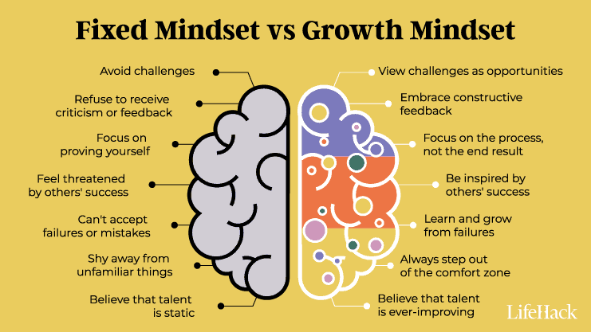
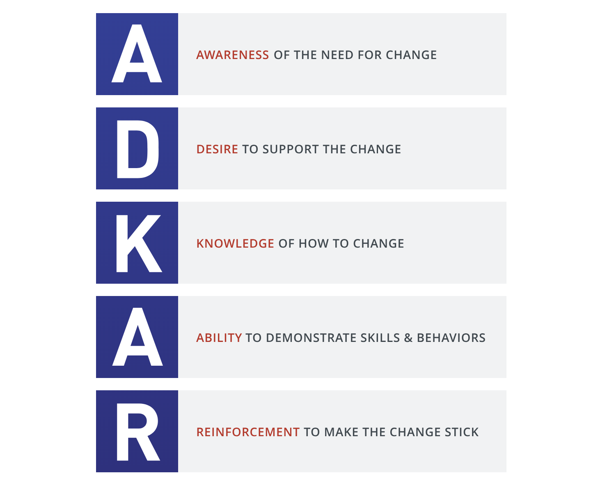
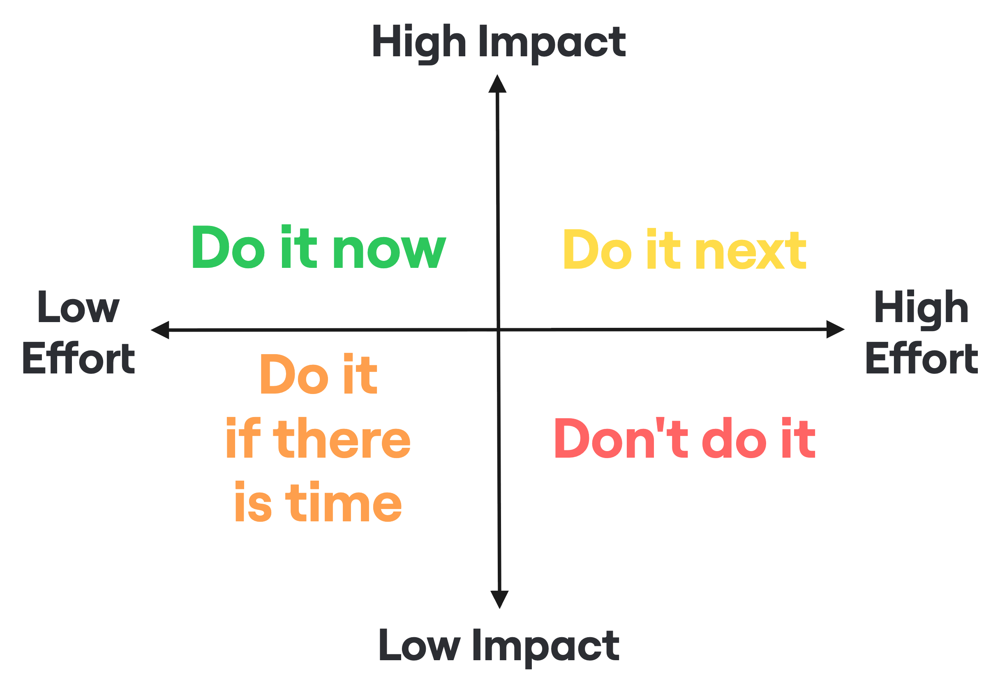
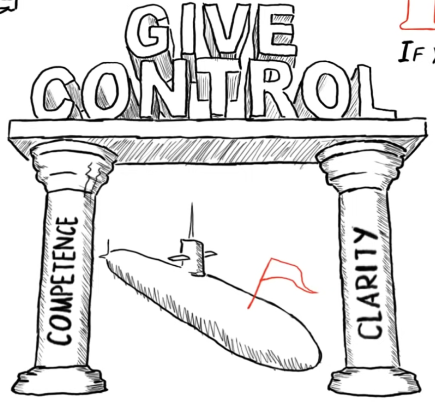
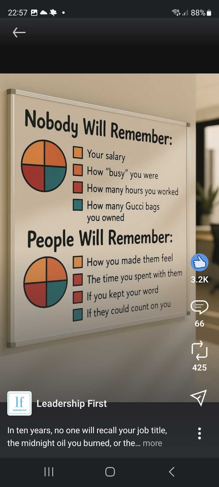

# Leadership – Is it for me?

*Goga Lampropoulou — Patras Tech Talk, March 1, 2026*

---

## The Engineering Leader Mindset

An effective engineering leader brings out the best in teams and individuals and creates an environment for them to cooperate and shine. This requires:

- **Agile mindset** — Plan → Do → Check → Adjust, continuously improving
- **Continuous learning** — always asking "What would I be if I did not make it better?"
- **Adaptability** — adjusting to change, understanding context, communicating clearly

---

## Leadership is all about Courage

Leadership is not a title — it happens across all levels:

- Every time you stepped up to help a colleague struggling
- Every time you pushed back and challenged your manager
- Every time you asked a question in a meeting
- Every time you identified a risk and voiced it

---

## Growth Mindset

Believing that skills and intelligence can be developed is the foundation of effective leadership. A growth mindset enables leaders to embrace challenges, persist through setbacks, and inspire their teams to do the same.

---

## It's All About Creating the Environment

Great leadership is about building the conditions for people to thrive.

**What I do:**
- Boost confidence
- Remove fear
- Build a leader mindset in others
- Build redundancy
- Set vision
- Share knowledge

**How I do it:**
- Understand needs and aspirations
- Communicate clearly and honestly
- Be transparent
- Provide support and coaching
- Show consistency

Core values underpinning everything: **Trust / Safety / Respect / Freedom / Happiness / True to Integrity / True to myself**

---

## How to Empower Change

Driving change requires more than authority. The ADKAR model:

- **Awareness** of the need for change
- **Desire** to support the change
- **Knowledge** of how to change
- **Ability** to demonstrate skills & behaviours
- **Reinforcement** to make the change stick

---

## The First Follower Principle

A lone voice doesn't create a movement — the first follower does. The first person who joins you turns an idea into something others can rally around. Building momentum requires finding and nurturing those first followers.

---

## Relative Prioritisation

When stepping into a new leadership role, use impact vs effort to prioritise:

- **Do it now** — high impact, low effort
- **Do it next** — high impact, high effort
- **Do it if there is time** — low impact, low effort
- **Don't do it** — low impact, high effort

**Immediate actions:** expand the team, mentor existing members, drive training across the organisation.

**Mid-to-long term:** revisit and optimise QA processes and KPIs, enhance collaboration with Product and Engineering, implement Agile (Scrum), cultivate a learning culture.

---

## Do You Have What It Takes to Turn the Ship Around?

Key questions every leader should ask themselves:

- What do I want to achieve as a leader?
- Am I building leaders — not just followers?
- Am I building strong, independent individuals?
- Am I building people who can think for themselves?

---

## Leadership as a Continuous Practice

- Leadership is a **continuous learning process**
- Leadership is a **state of being**, not a state of doing
- Start with **mindfulness** — always be aware of where you stand and what you need to course correct
- Don't lose your bearings

---

## Thank You

---

## References

- *Mindset: The New Psychology of Success* — Carol Dweck
- *ADKAR: A Model for Change in Business, Government and our Community* — Jeffrey M. Hiatt
- *Crucial Conversations: Tools for Talking When Stakes Are High* — Patterson, Grenny, McMillan, Switzler
- *Turn the Ship Around!: A True Story of Turning Followers into Leaders* — L. David Marquet
- [Leadership on a Submarine — Leadership Academy](https://www.youtube.com/watch?v=HYXH2XUfhfo)
- [First Follower: Leadership Lessons from Dancing Guy — Derek Sivers](https://www.youtube.com/watch?v=fW8amMCVAJQ)
- [UnderStudio Hub](https://www.youtube.com/@understudiohub)
- [LinkedIn: Leadership First](https://www.linkedin.com/company/leadership-first/)
- [Simon Sinek](https://www.linkedin.com/in/simonsinek/)
- [Richard Branson](https://www.linkedin.com/in/rbranson/)
