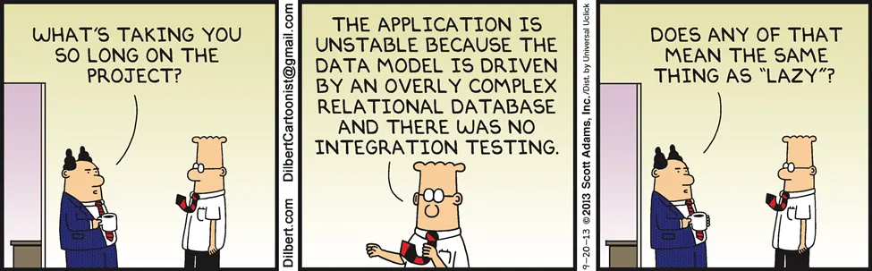
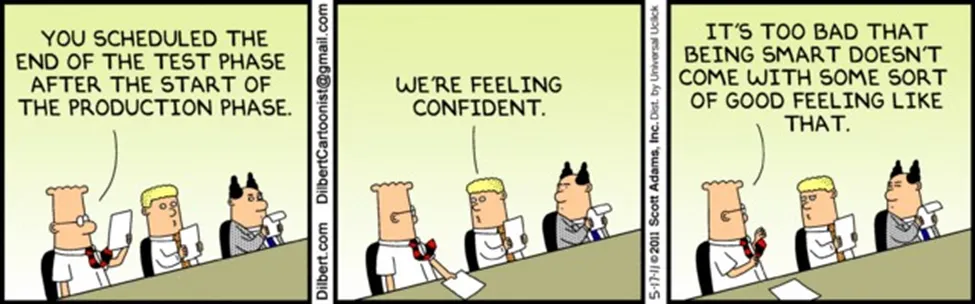
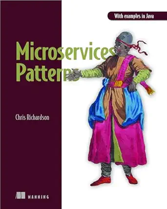
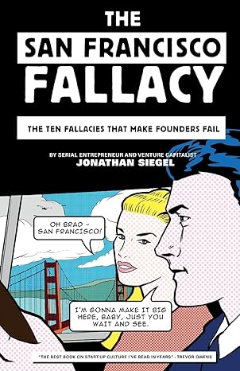
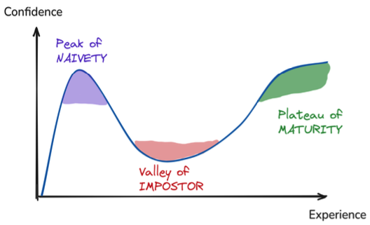

<!-- _class: lead -->

# Software Engineering Laws in Practice

## hard-earned lessons of wisdom

**Giannis Skitsas**  
Patras Tech Talk 2026.05 | May 26, 2026

---

<!-- _class: lead -->

# Learn from our mistakes

...our knowledge is limited to our experience

---

<!-- _class: lead -->

# We fight each other, our selves.. 

--- 

# Read the fu*king laws

.. myths, fallacies, practices, principles, patterns, theorems, laws

---

# But..

In theory, theory and practice are the same. In practice, they are not.

---

<!-- _class: lead -->

# My bible so far..

  
  
  

.. and other resources over the internet

---

<!-- _class: patterns-map -->

# List of Patterns 1/2

Patterns are another kind of long-lived software wisdom: reusable names for recurring design problems.

- **Application architecture patterns**
	- Monolithic architecture
	- Microservice architecture
- **Decomposition patterns**
	- Decompose by business capability
	- Decompose by subdomain
- **Messaging style patterns**
	- Messaging
	- Remote procedure invocation
- **Reliable communications patterns**
	- Circuit breaker
- **Service discovery patterns**
	- 3rd party registration
	- Client-side discovery
	- Self-registration
	- Server-side discovery
- **Transactional messaging patterns**
	- Polling publisher
	- Transaction log tailing
	- Transactional outbox
- **Data consistency patterns**
	- Saga
- **Business logic design patterns**
	- Aggregate
	- Domain event
	- Domain model
	- Event sourcing
	- Transaction script
- **Querying patterns**
	- API composition
	- Command query responsibility segregation

---

<!-- _class: patterns-map -->

# List of Patterns 2/2

Patterns help us discuss trade-offs without rediscovering the same solutions from scratch.

- **External API patterns**
	- API gateway
	- Backends for frontends
- **Testing patterns**
	- Consumer-driven contract test
	- Consumer-side contract test
	- Service component test
- **Security patterns**
	- Access token
- **Cross-cutting concerns patterns**
	- Externalized configuration
	- Microservice chassis
- **Observability patterns**
	- Application metrics
	- Audit logging
	- Distributed tracing
	- Exception tracking
	- Health check API
	- Log aggregation
- **Deployment patterns**
	- Deploy a service as a container
	- Deploy a service as a VM
	- Language-specific packaging format
	- Service mesh
	- Serverless deployment
	- Sidecar
- **Refactoring to microservices patterns**
	- Anti-corruption layer
	- Strangler application

---

# Law's map

<!-- _class: law-map -->

- **System and Architecture**
	- ***Gall's Law***
	- ***The Law of Leaky Abstractions***
	- Tesler's Law (Conservation of Complexity)
	- The CAP Theorem
	- Hyrum's Law
	- The Second-System Effect
	- Fallacies of Distributed Computing
	- ***The Law of Unintended Consequences***
	- ***Zawinski's Law***
- **People, Teams, and Organizations**
	- ***Conway's Law***
	- ***Brooks's Law***
	- Dunbar's Number
	- The Ringelmann Effect
	- Price's Law
	- Putt's Law
	- ***The Peter Principle***
	- ***The Bus Factor***
	- ***The Dilbert Principle***
- **Time, Estimation, and Planning**
	- Hofstadter's Law
	- ***Parkinson's Law***
	- The Ninety-Ninety Rule
	- Goodhart's Law
	- Gilb's Law
	- Knuth's Optimization Principle
- **Quality, Maintenance, and Evolution**
	- ***Murphy's/Sod's Law***
	- Postel's Law (The Robustness Principle)
	- The Broken Windows Theory
	- The Boy Scout Rule
	- Technical Debt
	- Linus's Law
	- Kernighan's Law
	- The Testing Pyramid
	- The Pesticide Paradox
	- Lehman's Laws of Software Evolution
	- Sturgeon's Law
- **Scale, Performance, and Growth**
	- ***Amdahl's Law***
	- Gustafson's Law
	- Metcalfe's Law
- **Coding and Design Principles**
	- DRY (Don't Repeat Yourself)
	- KISS (Keep It Simple, Stupid)
	- YAGNI (You Aren't Gonna Need It)
	- The SOLID Principles
	- The Law of Demeter
	- The Principle of Least Astonishment
- **Decision-Making and Cognitive Biases**
	- ***The Dunning-Kruger Effect***
	- Hanlon's Razor
	- Occam's Razor
	- The Sunk Cost Fallacy
	- The Map Is Not the Territory
	- Confirmation Bias
	- The Hype Cycle & Amara's Law
	- ***The Lindy Effect***
	- First-Principles Thinking
	- Inversion
	- ***The Pareto Principle (80/20 Rule)***
	- Cunningham's Law

---

<!-- _class: law -->

# Gall's Law

| | |
|---|---|
| **Introduced** | 1975, John Gall, *Systemantics* |
| **States** | Working complex systems evolve from working simple systems. |
| **Remember** | Start with something small that works. |

---

# Gall's Law in practice

**Situation:** A team wants a platform, plugin system, event bus, and workflow engine before the first user flow exists.

**Example move:**

- ship one useful end-to-end flow
- observe where complexity is actually needed
- let the platform earn its existence

---

<!-- _class: law -->

# The Law of Leaky Abstractions

| | |
|---|---|
| **Introduced** | 2002, Joel Spolsky |
| **States** | All non-trivial abstractions leak implementation details. |
| **Remember** | The thing underneath still matters. |

---

# Leaky abstractions in practice

**Situation:** The ORM hides SQL until a query becomes slow, locks rows, or loads thousands of objects.

**Example move:**

- learn the layer below your abstraction
- inspect generated SQL, network calls, and storage behavior
- do not confuse "hidden" with "gone"

---

<!-- _class: law -->

# The Law of Unintended Consequences

| | |
|---|---|
| **Introduced** | Social-science concept popularized by Robert K. Merton, 1936 |
| **States** | Whenever you change a complex system, expect surprise. |
| **Remember** | Significant changes can produce results nobody planned. |

---

# Unintended consequences in practice

**Situation:** A password policy forces users to change passwords every 30 days with letters and symbols.

Users respond with `Password1`, `Password2`, `Password3`...

The security rule made passwords easier to guess.

**Example move:**

- ship small
- observe broadly
- keep rollback boring
- watch for side effects, not only success

---

<!-- _class: law -->

# Zawinski's Law

| | |
|---|---|
| **Introduced** | 1995, Jamie Zawinski |
| **States** | Every program attempts to expand until it can read mail. |
| **Remember** | Successful software attracts scope. |

---

# Zawinski's Law in practice

**Situation:** Today, "read mail" becomes: every tool wants to become a chat app, a project management tool, or an AI assistant.

**Example move:**

- protect the product boundary
- say no to unrelated workflows
- integrate with existing tools instead of becoming every tool

---

<!-- _class: law -->

# Brooks's Law

| | |
|---|---|
| **Introduced** | 1975, Fred Brooks, *The Mythical Man-Month* |
| **States** | Adding manpower to a late software project makes it later. |
| **Remember** | People add communication cost before they add output. |

---

# Brooks's Law in practice

**Situation:** A project is late, so leadership adds more engineers into a tangled codebase.

**Example move:**

- reduce scope first
- split separable work
- remove blockers for the current team
- add people only where onboarding is cheap

---

<!-- _class: law -->

# Conway's Law

| | |
|---|---|
| **Introduced** | 1968, Melvin E. Conway |
| **States** | Systems mirror the communication structures of the organizations that build them. |
| **Remember** | Team boundaries become architecture boundaries. |

---

# Conway's Law in practice

**Situation:** Three teams share one customer journey, but every change needs meetings, cross-team tickets, and shared database migrations.

**Example move:**

- align ownership with user journeys or domains
- make interfaces explicit
- Inverse Conway Maneuver: software architects, engineers, and leaders in defining organizational structures
- reduce coordination before adding process

---

<!-- _class: law -->

# The Peter Principle

| | |
|---|---|
| **Introduced** | 1969, Laurence J. Peter and Raymond Hull |
| **States** | People in a hierarchy tend to rise to their level of incompetence. |
| **Remember** | Promotion is not the same as fit. |

---

# The Peter Principle in practice

**Situation:** A great senior engineer becomes an unhappy manager, and the team loses both a technical leader and effective management.

**Example move:**

- create dual career tracks
- train managers before promotion
- make moving back to IC work acceptable

---

<!-- _class: law -->

# The Dilbert Principle

| | |
|---|---|
| **Introduced** | 1995/1996, Scott Adams |
| **States** | Satirically: less effective people are moved into management, away from productive work. |
| **Remember** | Bad governance can damage good execution. |

---

# The Dilbert Principle in practice

**Situation:** A manager creates steering committees, alignment meetings, and status rituals that slow down the people doing the work.

**Example move:**

- keep decision rights close to the work
- measure management by team outcomes
- remove meetings that do not change decisions

---

<!-- _class: law -->

# The Bus Factor

| | |
|---|---|
| **Introduced** | Software project risk term, popularized in open-source communities |
| **States** | A project is fragile if too few people hold critical knowledge. |
| **Remember** | "Only Maria knows this" is a risk, not a strategy. |

---

# Bus Factor in practice

**Situation:** One person owns deployment, billing, and the production database migration script.

**Example move:**

- rotate operational ownership
- document runbooks
- pair on risky areas
- rehearse recovery without the usual expert

---

<!-- _class: law -->

# Parkinson's Law

| | |
|---|---|
| **Introduced** | 1955 essay / 1958 book, C. Northcote Parkinson |
| **States** | Work expands to fill the time available. |
| **Remember** | Time boxes shape solutions. |

---

# Parkinson's Law in practice

**Situation:** A "small cleanup" gets a three-week window, so it becomes a framework rewrite.

**Example move:**

- set short checkpoints
- define "good enough" early
- use constraints to reveal the simplest valuable version

---

<!-- _class: law -->

# Murphy's / Sod's Law

| | |
|---|---|
| **Introduced** | Popularized from 1940s engineering culture; variants are older |
| **States** | If something can go wrong, assume it eventually will. |
| **Remember** | The unhappy path is part of the design. |

---

# Murphy's Law in practice

**Situation:** The happy path works, but production adds timeouts, retries, duplicate clicks, expired tokens, and full disks.

**Example move:**

- design retries and idempotency
- make rollback boring
- test partial failure
- alert the owner, not everyone

---

<!-- _class: law -->

# Amdahl's Law

| | |
|---|---|
| **Introduced** | 1967, Gene Amdahl |
| **States** | Overall speedup is limited by the part that cannot be parallelized. |
| **Remember** | One bottleneck can dominate the whole system. |

---

# Amdahl's Law in practice

**Situation:** The team scales app servers, but every request still waits on one slow database query.

**Example move:**

- find the serial bottleneck first
- optimize the constraint
- avoid scaling everything except the limiting part

---

<!-- _class: law -->

# The Dunning-Kruger Effect

| | |
|---|---|
| **Introduced** | 1999, David Dunning and Justin Kruger |
| **States** | People with low skill in an area may overestimate their competence. |
| **Remember** | Confidence is not evidence. |

---

# Dunning-Kruger in practice

**Situation:** Someone who has never run production Kubernetes designs the cluster strategy after one tutorial.

**Example move:**

- ask for evidence and failure modes
- pair confidence with review
- prefer small experiments over big declarations

---

<!-- _class: law -->

# The Lindy Effect

| | |
|---|---|
| **Introduced** | Named from Lindy's deli observations; popularized by Albert Goldman, Benoit Mandelbrot, and Nassim Nicholas Taleb |
| **States** | For some non-perishable things, future life expectancy grows with current age. |
| **Remember** | Boring old ideas often survive for a reason. |

---

# The Lindy Effect in practice

**Situation:** The team wants to replace PostgreSQL with this week's exciting database because the demo looked amazing.

**Example move:**

- value battle-tested tools
- distinguish novelty from durability
- use new tech where the upside justifies the operational risk

---

<!-- _class: law -->

# The Pareto Principle

| | |
|---|---|
| **Introduced** | Vilfredo Pareto's 1890s/1900s observations; generalized by Joseph Juran |
| **States** | A minority of causes often produces a majority of effects. |
| **Remember** | Impact is uneven. |

---

# Pareto in practice

**Situation:** (Micorsoft) around 20% of bugs in Windows and Office were responsible for 80% of all crashes and errors observed. And that a tiny 1% of bugs caused around 50% of errors.

**Example move:**

- measure before optimizing
- find the high-impact 20%
- do fewer things with more effect

---

<!-- _class: lead -->

# Lessons learned

There is no law that applies to everything. That is not a flaw. That is the point.

**The real question is:** which forces matter most here?
- ask which laws apply
- ask which laws do not apply
- combine them before deciding

Knowing individual laws is useful. The real leverage is combining them.

---

<!-- _class: lead -->

# Why they persist

These laws are persistent because they do not deal with technology.

They deal with something much more solid: **human behavior, mathematical limits, and organizational physics.**

---

<!-- _class: small -->

# Last words

- The best engineers are obsessed with solving user problems.
- Clarity is seniority. Cleverness is overhead.
- The best code is the code you never had to write.
- Most performance wins come from removing work, not adding cleverness.
- Most "slow" teams are actually misaligned teams.
- Writing forces clarity. The fastest way to learn something better is to try teaching it.
- Admitting what you do not know creates more safety than pretending you do.
- Eventually, time becomes worth more than money. Act accordingly.

---

# References

<!-- _class: small -->

- Milan Milanovic, *<a href="https://www.amazon.com/dp/B0GXFCD1PT">Laws of Software Engineering</a>*  
- Chris Richardson, *<a href="https://www.amazon.com/dp/1617294543">Microservices Patterns</a>*
- Jonathan Siegel, *<a href="https://www.amazon.com/dp/1619616327">The San Francisco Fallacy</a>*
- Addy Osmani, *<a href="https://addyo.substack.com/p/21-lessons-from-14-years-at-google">21 lessons from 14 years at google</a>*
- Titian, *Sisyphus*, public domain image, <a href="https://commons.wikimedia.org/wiki/File:Punishment_sisyph.jpg">Wikimedia Commons</a> 
- Wikipedia / the <a href="https://en.wikipedia.org/wiki/Sisyphus">Sisyphus myth</a> 

---

# Thank you

## Questions?

**Giannis Skitsas**  
Patras Tech Talk | May 26, 2026
